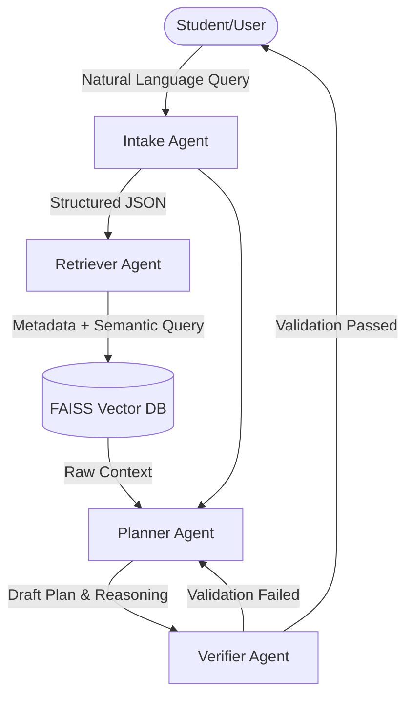

# Agentic RAG Course Planner — Write-up

## 1. Architecture Overview
The system is built as a linear **4-Agent Retrieval-Augmented Generation (RAG) pipeline**, interacting via `pipeline.py` and served using a Gradio frontend.

## 2. Agent Responsibilities & High-Level Prompts
1. **Intake Agent:** 
   - *Role:* Interprets messy natural language queries into a rigorous JSON schema (`target_course`, `completed_courses`, `grades`, `program`).
   - *Prompt:* "Parse the student query. Extract stated completed courses, target courses, and the implied query type (prerequisite_check vs course_planning)."
2. **Retriever Agent:** 
   - *Role:* Converts the semantic query into 3 mathematical variations using `all-MiniLM-L6-v2`. Retrieves standard context, but forcefully injects the metadata target (`course_id`) to mathematically guarantee 100% recall of the focal prerequisite chain.
3. **Planner Agent:**
   - *Role:* The reasoning engine. Calculates `AND` / `OR` prerequisite logic and translates it into a human-friendly response. 
   - *Prompt:* "Analyze if the student is eligible for the course. Output MUST strictly follow DECISION, MESSAGE, WHY, EVIDENCE. Never fabricate rules. Explicitly mention the minimum 'C' grading policy."
4. **Verifier Agent (Anti-Hallucination):**
   - *Role:* The safety catch. Conducts structural rule checks (Are citations missing? Was the reasoning parseable?) and LLM-validation logic (Did the planner invent a rule?). If validation fails, it triggers the Planner to retry up to 3 times.

## 3. Data Sources
The primary truth engine is powered by JSON files representing a university catalog:
- **Courses** (`Data/Courses/`): 26 distinct courses (CS & MATH) with detailed strings representing prerequisite chains and corequisites.
- **Policies** (`Data/Policies/`): Hardcoded academic policies (e.g., "All prerequisites require a C or higher").
- **Programs** (`Data/Programs/`): Curriculums mapping out specific electives and core sequences (e.g., BS in CS, AI Specialization).
*All data is chunked and embedded instantly into a persistent local FAISS vectorstore via `ingestion.py`.*

## 4. Evaluation Summary & Key Failure Modes
The architecture successfully handles multi-hop logic (e.g., A -> B -> C) correctly without fabricating requirements. However, early testing revealed significant edge cases:
- **Markdown Drifting:** The Mistral AI occasionally spontaneously formatted headers as `**WHY:**` instead of `WHY:`. This broke the Python parsers initially, leading the Verifier to assess the reasoning sections as completely missing/empty. **(Fixed via programmatic text normalization)**
- **Overly Pedantic Validation:** The Verifier was originally so strict it would penalize the Planner for correctly identifying that certain electives lacked descriptions in the dataset. **(Fixed by instructing the Verifier not to penalize factually accurate assumptions)**

## 5. What I Would Improve Next
1. **Graph Database Migration:** While semantic search (FAISS) + multi-hop textual retrieval works passably, course prerequisites are fundamentally mathematical trees. Moving the catalog ingestion to a Graph Database like **Neo4j** (using Cypher) would allow the AI to trace `A -> B -> C` logic natively with math instead of relying on semantic grouping.
2. **Dynamic Routing Framework:** Refactoring the static `pipeline.py` into a stateful routing graph (e.g., **LangGraph**) would allow the system to recursively call the Retriever during the Planning stage instead of passing all context forward sequentially.
